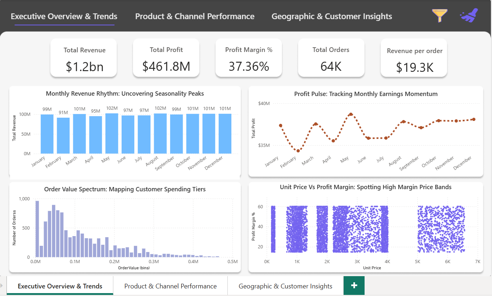
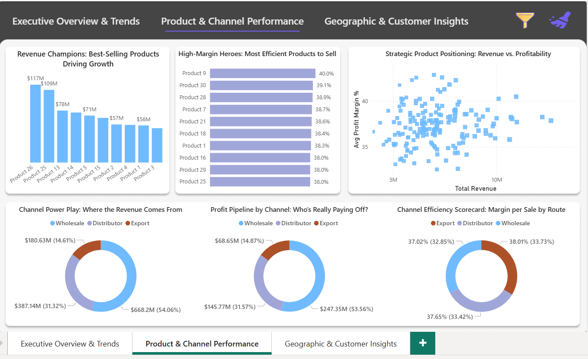
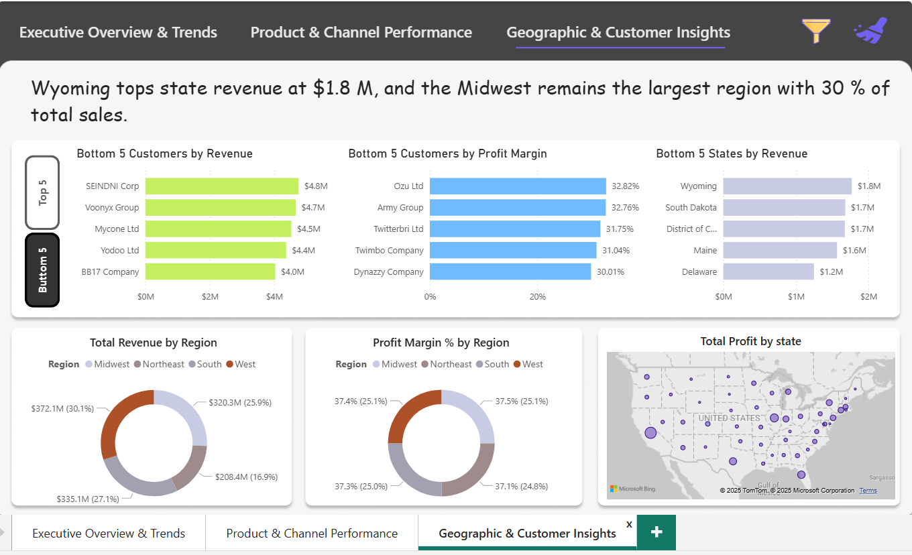

# 📊 Regional Sales Analysis

## 📌 Project Overview
This project analyzes **5 years of historical U.S. sales data** to uncover regional performance patterns, identify growth levers, and support strategic decision-making.  
The work integrates **Python (EDA & preprocessing), Excel (raw data management), Power BI (dashboards), and a PPT report (business insights).**

---

## 🎯 Problem Statement
Sales teams often face challenges due to:
- Inconsistent revenue and profit across U.S. regions  
- Lack of visibility into **seasonality, top-performing SKUs, and channel profitability**  
- Limited tools for self-service insights  

👉 Goal: Leverage historical sales data to **pinpoint growth opportunities** and **optimize sales strategy**.

---

## 🛠️ Tools & Technologies
- **Python**: Data preprocessing, feature engineering, EDA, and visualization (`pandas`, `numpy`, `matplotlib`, `seaborn`).  
- **Excel**: Raw data exploration and cleaning before integration.  
- **Power BI**: Interactive dashboards for regional sales, customer segmentation, and revenue scenarios.  
- **PPT (Report)**: Business presentation summarizing findings, insights, and recommendations.  

---

## 🔄 Project Workflow
1. **Data Collection** – Sales, products, budgets, customers, regions, and states data.  
2. **Preprocessing & Cleaning**  
   - Standardized column names  
   - Merged multiple tables (Sales, Customers, Products, Budgets, Regions)  
   - Created new features (Profit, Profit Margin %)  
   - Verified no missing or duplicate values  
3. **Exploratory Data Analysis (EDA)**  
   - Trend analysis (seasonality, monthly revenue cycles)  
   - Product performance (Top SKUs by revenue and profit margin)  
   - Channel profitability (Wholesale, Distributor, Export)  
   - Regional & state-level sales comparisons  
   - Customer segmentation by revenue & profit margin  
4. **Visualization & Dashboards**  
   - Python: Charts & heatmaps  
   - Power BI: Interactive dashboards (Performance Summary, Customer Segmentation, Revenue Scenarios)  
5. **Reporting** – Insights consolidated in a PPTX report.  

---

## 📊 Key Insights
- **Seasonality**: Sales peak in May–June; dip in January and April.  
- **Product Performance**: Products **26 & 25** drive ~25% of total revenue.  
- **Channel Analysis**: Wholesale = 54% sales volume; Export = highest margin (~38%).  
- **Geography**: California leads with $230M in sales; Northeast shows weakest performance.  
- **Customers**: Revenue heavily concentrated in top clients (e.g., Aibox Company).  

---

## ✅ Recommendations
- **Seasonal Promotions**: Boost sales during low months (April & January).  
- **SKU Optimization**: Double down on top products, phase out low-margin SKUs.  
- **Channel Strategy**: Expand Export partnerships for margin gains.  
- **Regional Investment**: Replicate California’s model in other states, target Northeast for growth.  
- **Margin Monitoring**: Track orders below 80% margin for corrective action.  

---

## 📌 Deliverables
- **Python Notebook** → Preprocessing, EDA, and visualizations.  
- **Excel Sheets** → Source data and cleaned datasets.  
- **Power BI Dashboard** → Interactive analysis for stakeholders.  
- **PPT Report** → Business presentation of insights and strategy.  

---

## 📷 Dashboard Preview

---

## 📢 Conclusion
This project demonstrates how **Python, Excel, and Power BI** can be combined for end-to-end **data-driven sales analysis**.  
The approach provides actionable insights for business growth, supports operational planning, and enables stakeholders to self-serve real-time analysis.

---
<video src="Regional_Sales_Analysis.mp4" width="600" controls></video>

👨‍💻 **Author**: Muhammad Usman Akram  
📌 *Machine Learning Engineer | Data Analyst | Business Insights Enthusiast*  
